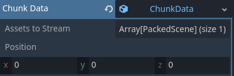
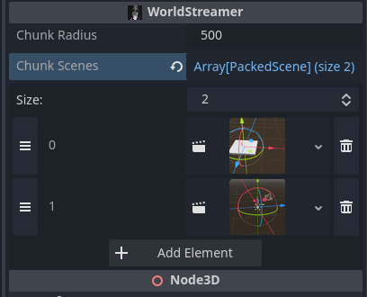

# World Streaming Addon for Godot

A simple world streaming system specifically built for the usage of Project 95. Nothing too fancy here, loads chunks from their custom resource position and checks if it's within the radius of the player.

Create Chunks by attaching `chunk.gd` to a node, create a ChunkData resource in the Inspector and adjust the position. You can also add more assets that are also supposed to be PackedScenes to be streamed.

> **Note**
> This is built specifically for the usage of Project 95. A open-world 3D platformer/metroidvania that has a low poly art style. So, it might not be usable for any game on a higher level than that.

## Tutorial

Next, add a WorldStreaming node. Within here, you can add your Chunks as PackedScenes and change the radius of what loads near the player.

## Conclusion

This shit is mainly for me to remember because I get dementia sometimes.I don't know if I'll ever publicly release this, but it'd be pretty cool if I did because it's wildly convenient although I don't think I will because I feel like it's too lame feeling.